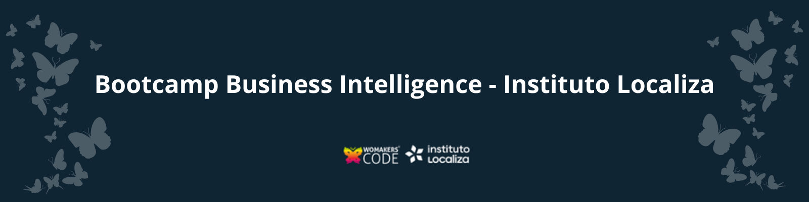

# Bootcamp Business Intelligence - WoMakersCode

A WoMakersCode é a maior comunidade de mulheres na tecnologia da América Latina, com foco em impulsionar a formação técnica e a empregabilidade de mulheres em diversas carreiras digitais, por meio de cursos, mentorias, bootcamps e programas de capacitação.
A organização também oferece bolsas de estudo para promover acessibilidade às formações e realiza eventos e iniciativas de networking que conectam mulheres ao ecossistema de tecnologia e às oportunidades do mercado.

Tive a oportunidade de ser **bolsista** em um dos bootcamps da WoMakersCode, onde aprofundei meus conhecimentos em Business Intelligence, desenvolvendo projetos práticos para portfólio e aprimorando tanto habilidades técnicas quanto soft skills voltadas para o mercado de trabalho em tecnologia.

## 📂Estrutura deste Portfólio

Repositório com os desafios, exercícios práticos e materiais que fiz ao longo do **Bootcamp de Business Intelligence do Instituto Localiza em parceria com a WoMakersCode**, focado em formação completa para atuar com dados, desde os fundamentos até projetos de BI. 

- **DESAFIOS/**  
  Atividades e projetos entregáveis para avaliação e portfólio, feito em equipe. Segue o perfil no GitHub da nossa squad Nina da Hora com os entregáveis.  
  Perfil do GitHub: [Nina-Da-Hora](https://github.com/Nina-Da-Hora)
  
- **EXERCÍCIOS/**  
  Exercícios guiados feitos durante as aulas, passo a passo, para fixar conceitos e técnicas de Business Intelligence.  

Também tivemos encontros ao vivo com profissionais da área, que compartilharam experiências sobre carreira em tecnologia, além de plantões tira-dúvidas tanto dos conteúdos quanto dos projetos. Durante o programa, realizamos apresentações ao vivo de quatro projetos, incluindo o projeto final, para a banca da organização, simulando um ambiente real de apresentação de soluções em dados para o mercado.

## 📚Conteúdo do bootcamp

O bootcamp foi estruturado em módulos semanais, cobrindo todo o ciclo de dados: da governança à visualização e IA para BI. 

### Introdução e Metodologias Ágeis

- **Onboarding**  
  Apresentação do programa, ferramentas utilizadas, ambiente e boas práticas de versionamento e organização.  
- **Semana 01 – Mercado de Dados**  
  Panorama de carreira em dados, papéis (BI, Analytics, Engenharia, Ciência de Dados) e contexto de Business Intelligence.  
- **Semana 02 – Métodos Ágeis e Governança de Dados**  
  Scrum, Kanban, fluxo de trabalho em times de dados, fundamentos de governança, qualidade e segurança da informação. 
  Tipos de dados, métricas, KPIs, estatística básica e raciocínio analítico aplicado a negócios.  
- **Semana 04 – Fundamentos de BI para Negócios + Data Analysis com Google Sheets**  
  Conceitos de data warehouse, camadas de dados, construção de indicadores em planilhas e protótipos de dashboards. 

### Banco de dados e SQL

- **Semana 05 – Banco de Dados SQL I e II + Entregáveis**  
  Conceitos de banco relacional, modelagem básica, comandos DDL e DML, consultas com `SELECT`, filtros, ordenação, funções de agregação e `JOIN`. 
- Prática com cenários de negócio e criação de consultas para análise de indicadores.
- [Entregável 1](https://github.com/Nina-Da-Hora/Squad-Nina-Da-Hora---Exercicio-Banco-de-Dados-SQL-I)
- [Entregável 2](https://github.com/Nina-Da-Hora/Squad-Nina-Da-Hora-Exercicio-Banco-de-Dados-SQL-II)

### Python para Dados e Pipelines

- **Semana 06 – Python para Dados**  
  Fundamentos de Python, tipos de dados, estruturas de controle, funções e introdução a análise de dados com bibliotecas como `pandas`. 
- **Semana 07 e 08 – Data Wrangling e Pipelines em Python + Entregável e Apresentação - Pipeline de Vendas**  
  Leitura de dados, tratamento, limpeza, transformação, junções, criação de pipelines e boas práticas de organização de notebooks.
  [Projeto Pipeline de Vendas](https://github.com/Nina-Da-Hora/data-wrangling-pipeline)  

### ETL, Transformação e Limpeza

- **Semana 09 – Fundamentos de ETL e Extração de Dados**  
  Conceitos de ETL/ELT, fontes de dados, ingestão e desenho de fluxos de dados. 
- **Semanas 10 e 11 – Transformação e Limpeza de Dados**  
  Normalização, padronização, tratamento de valores ausentes, outliers e preparação de dados para uso em BI.  
- **Semana 12 – Carregamento e Integração**  
  Técnicas de carga de dados em bases/ambientes analíticos e integração entre ferramentas.

### GitHub, projetos e storytelling

- **Semana 13 – Projeto prático**  
  Desenvolvimento de um projeto de dados unindo extração, transformação e visualização, além da apresentação.
  [Pipeline de ETL Integrado: Análise de Fatores de Sucesso para Redução de Gordura Corporal](https://github.com/Nina-Da-Hora/pipeline-etl-integrado)
- **Semana 14 – GitHub para Dados** 
  Uso de Git e GitHub no contexto de dados: versionamento de notebooks, organização de repositórios e colaboração. 
- **Semana 15 – Desafio: Pipeline de ETL integrado**  
  Criação de um pipeline completo, do dado bruto ao dataset pronto para consumo em BI.

### Visualização de dados e dashboards

- **Semana 16 – Criando gráficos com bibliotecas Python**  
  Visualização com bibliotecas Python (por exemplo, Matplotlib/Seaborn/Plotly), boas práticas de dataviz, escolha de gráficos e design.  
- **Semana 17 – Tableau**  
  Criação de dashboards interativos, conexões com fontes de dados e design de relatórios em ferramenta de BI visual. 
- **Semana 18 – Storytelling de Dados + Entregável Projeto de Storytelling**  
  Técnicas de storytelling, como estruturar narrativas com dados, destacar insights e comunicar resultados para áreas de negócio.
  [Projeto - Storytelling de Dados - Entrega e Satisfação pelo Brasil](https://github.com/ingridcos/WoMakersCode/tree/main/DESAFIOS/Projeto_Storytelling)

### Cloud, Databricks e IA aplicada a BI

- **Semana 19 – Cloud**  
  Conceitos de cloud computing voltados para dados, vantagens, componentes principais e uso de serviços na nuvem em cenários de BI.  
- **Semanas 19 e 20 – Introdução ao Databricks para BI**  
  Introdução à plataforma Databricks para análise de dados, notebooks, SQL, data lakes e recursos voltados a BI. 
- **Semanas 20 e 21 – Inteligência Artificial aplicada a BI**  
  Uso de técnicas de IA/ML e recursos de AI/BI para enriquecer análises, automatizar insights e apoiar tomada de decisão em Business Intelligence.

- **Semana 22 em diante – Plantões tira-dúvidas, Uso do Linkedln e Projeto Final**  
  Encontros ao vivo de revisão, dúvidas e aprofundamento.  
- **Projeto Final**  
  Construção de um projeto completo de Business Intelligence, integrando:  
  - modelagem e governança de dados,  
  - ETL/ELT e pipelines,  
  - análise exploratória,  
  - visualização e storytelling,  
  - publicação e apresentação do case de negócio.
  -[Projeto Final - Análise Estratégica de Marcas Automotivas](https://github.com/Nina-Da-Hora/analise-estrategica-marcas-automotivas)

## 🛠️Tenologias utilizadas

Algumas das principais ferramentas e tecnologias utilizadas ao longo do bootcamp

- **Linguagens**: Python, SQL, SQLite  
- **Análise e manipulação de dados**: `pandas`, `numpy`, `Google Sheets`, `Google Colab`, `VS Code` 
- **Visualização e Dashboards**: Bibliotecas Python (gráficos), Power BI e Tableau 
- **Versionamento**: Git e GitHub  
- **Cloud e Plataformas de Dados**: Serviços de Cloud para dados, Databricks para BI  
- **Conceitos de BI**: ETL/ELT, Data Warehousing, Governança de Dados, Storytelling, IA aplicada a BI

## 💻Como navegar neste repositório

- Explore a pasta **DESAFIOS/** para ver desafios e projetos realizados.  
- Explore a pasta **EXERCÍCIOS/** para acompanhar exercícios guiados e exemplos de código.  
- Explore o Github da squad Nina da Hora ao qual fiz parte durante todo o Bootcamp: Perfil do GitHub: [Nina-Da-Hora](https://github.com/Nina-Da-Hora)

